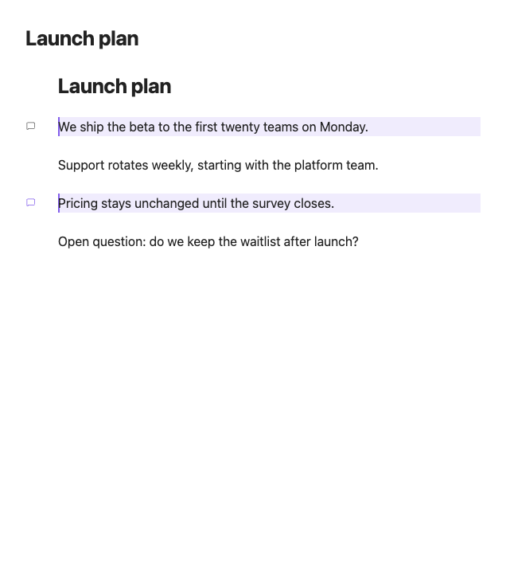
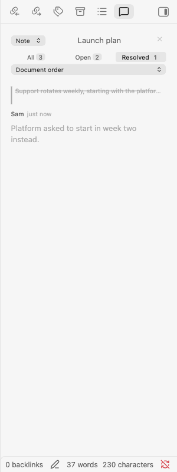
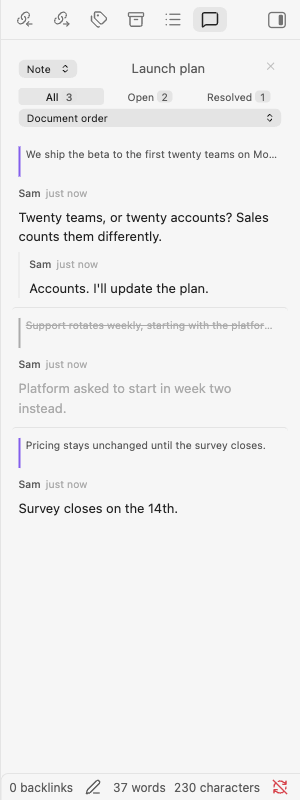
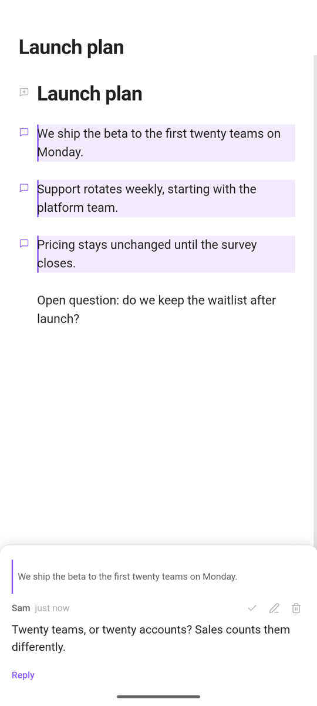

# Margin Comments for Obsidian

Comment on your Obsidian notes the way you would on a shared document: threaded replies, resolve and reopen, and a sidebar panel. Your Markdown files are never modified.

> **Status:** not yet released. The first release is 1.0.0; see [CHANGELOG.md](CHANGELOG.md).

## Features

- **Comments on a line or a selection.** Hover the left edge of a line to comment on it, or select text and comment on the selection.
- **Threaded replies**, one level deep. Edit in place, resolve and reopen, and delete with the replies it takes named up front.
- **Highlights and gutter markers.** A comment on a selection marks those words, and a comment on a whole line tints the line. A marker carries a count when a line holds several threads.
- **Popover or panel.** Click a marker to read the thread beside the line, or in the sidebar when it is open.
- **Sidebar panel.** Filter by all, open or resolved, and sort by document order, date or last activity. An all-notes view lists every commented note in the vault.
- **Reading mode.** Commented text is highlighted, and a click or tap on a mark opens its thread.
- **Mobile and touch.** Markers without hover, thumb-sized controls, and a composer that stays above the on-screen keyboard.
- **Keyboard and screen readers.** Every control is reachable without a mouse and has a name.
- **Theme-aware.** Colours and type come from your Obsidian theme.
- **Safe storage.** Comments live in `.margin-comments/`. A damaged file is set aside and announced, never overwritten.

## Installation

### From Community plugins

Once the plugin is listed:

1. Open **Settings → Community plugins → Browse**.
2. Search for **Margin Comments**.
3. Select **Install**, then **Enable**.

### Manually

1. Download `main.js`, `manifest.json` and `styles.css` from the [latest release](https://github.com/jonaas-dev/obsidian-margin-comments/releases/latest).
2. Create the folder `<your vault>/.obsidian/plugins/margin-comments/` and copy the three files into it.
3. Reload Obsidian, then enable **Margin Comments** in **Settings → Community plugins**.

## Usage

### Adding a comment

Hover the left edge of a line until the marker appears, then click it. To comment on part of a line, select the text first. Type in the composer and send.

On a touch device, tap the marker: markers stay visible on commented lines and on the line holding the cursor. With gutter icons turned off, use the **Add comment to selection** command.

### Reading and replying

Click a marker to open its thread in a popover, or in the panel when the panel is visible. Reply at the foot of the thread.

### Resolving

Resolve a thread from its card. A resolved thread keeps its comments but loses its highlight, and the panel's **Resolved** filter still lists it.

### The panel

Open it with the ribbon icon or the **Toggle comments panel** command. It shows the current note by default; switch it to the whole vault to list every commented note.

### Reading mode

Comments are created in editing mode. In reading mode the plugin highlights commented text and opens threads from the rendered note: in the panel when it is visible, in a popover otherwise, or a bottom sheet on a phone. A link inside a mark keeps its normal click, and finishing a text selection does not open a thread.

Reading mode has no gutter, so there is nowhere to add a comment there. Some comments cannot be marked around their words, because the rendered note does not contain them: a comment on Markdown syntax, such as the asterisks in `**bold**` or a link's target, a whole-line comment, or a comment inside a code block. Those mark their whole block with a rule down its left edge instead.

### On a phone

## Configuration

Open **Settings → Margin Comments**.

| Setting | Default | What it does |
| --- | --- | --- |
| Author name | empty | Stamped on comments you write from now on. |
| Gutter icons | on | The markers in the left margin. Without them, comments are added with the **Add comment to selection** command. |
| Comment count | on | Badges a marker with the number of open threads on its line, when there is more than one. |
| Highlight commented lines | on | Tints lines carrying an open comment. Also turns off highlights in reading mode. |
| Follow the theme accent | on | Takes the highlight from the theme's accent colour. |
| Highlight colour | — | Shown when **Follow the theme accent** is off: the colour used in every theme. |
| Fuzzy matching tolerance | 0.3 | How far edited text may drift before a comment stops finding it. |
| When a note is deleted | Delete its comments | Deleted comments come back if the note is restored before Obsidian closes. Kept comments stay readable in the all-notes view. |
| Side | Right | Which sidebar the panel opens in. |
| Sort order | Document order | The panel's order: document order, date created, or last activity. |

## Commands

None has a default hotkey. Bind the ones you use in **Settings → Hotkeys**.

| Command | What it does |
| --- | --- |
| Add comment to selection | Comments on the selected text, or on the line holding the cursor. |
| Toggle comments panel | Opens or closes the sidebar panel. |
| Go to next comment | Moves the cursor to the next commented line. |
| Go to previous comment | Moves the cursor to the previous commented line. |
| Resolve all comments in this note | Resolves every open thread in the note, after confirming. |

## How it works

Comments are stored as JSON files in `.margin-comments/` at the vault root: one file per commented note, plus an index of which notes have comments and how many. Markdown files are never modified, so comments survive Obsidian updates and are easy to back up or move.

Each comment remembers the text it was made on, not a line number, so it follows that text as the note is edited. A comment whose text is gone is shown as orphaned rather than dropped.

> **Obsidian Sync:** files and folders beginning with `.` are treated as hidden and are not synced, with `.obsidian` as the only exception. If you use Obsidian Sync, comments stay on the device where they were written unless you sync `.margin-comments/` another way. Git, iCloud and Dropbox sync the folder like any other.

### Panel size

The panel draws every thread it shows. On a note with a thousand comments that costs about 250 ms, once, when the panel opens or repaints; scrolling stays within the frame budget however many there are. There is no virtual scrolling, deliberately: it would cost `Cmd+F` and Tab reaching the threads that are off screen.

## Privacy and storage

Each file is plain, unencrypted JSON. Per comment it stores the note's path in the vault, the commented text plus about 50 characters on either side, the comment, the author name from settings, and timestamps. `_index.json` lists the path of every commented note.

Because `.margin-comments/` holds excerpts from your notes, treat it as part of your vault when sharing or publishing:

- **Publishing a vault** through Git, Quartz or a similar tool publishes the folder unless you exclude it. That can include excerpts from notes that are not published themselves, and comments on deleted notes when **When a note is deleted** is set to keep them.
- **Syncing** shares every comment in the folder, including author names.
- **Deleting text from a note** does not remove it from the comment until the comment itself is deleted.

To keep the folder out of Git, add `.margin-comments/` to `.gitignore`.

## Contributing

See [CONTRIBUTING.md](CONTRIBUTING.md) for the development setup.

## License

[MIT](LICENSE)
