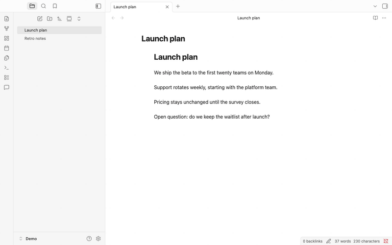
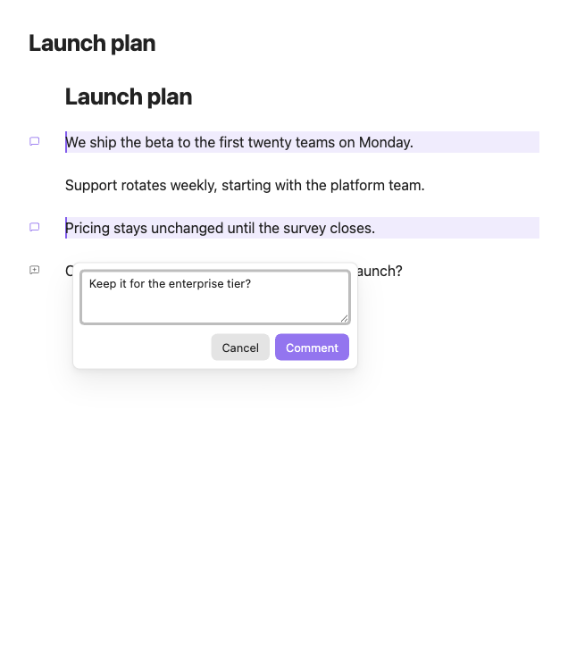
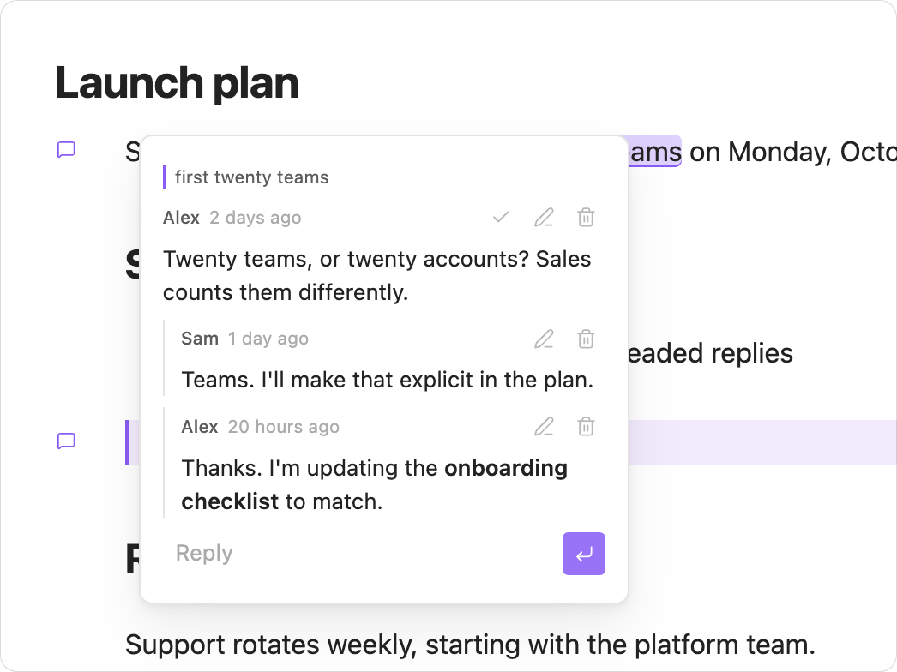
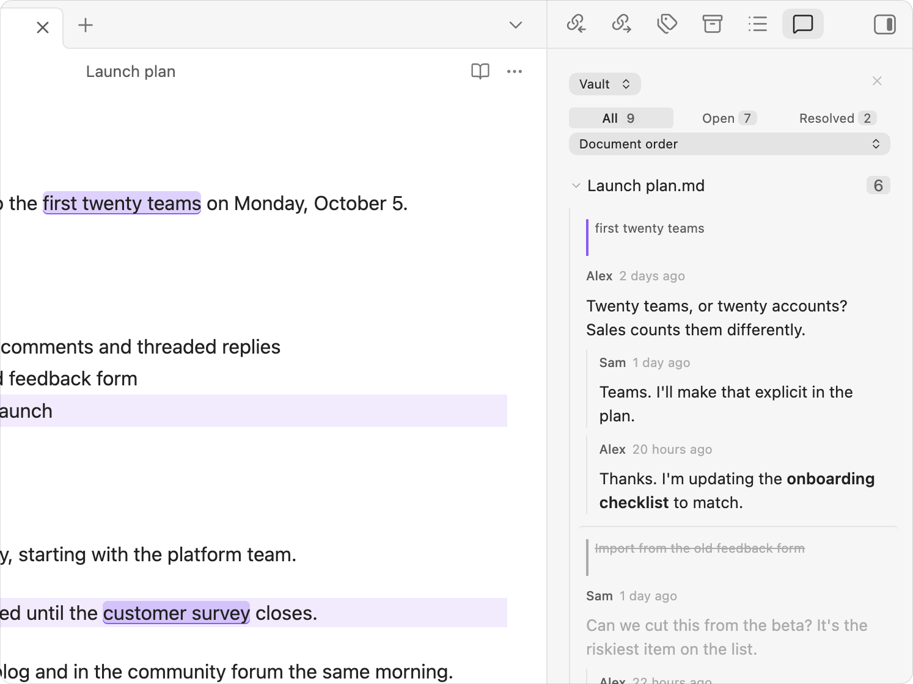
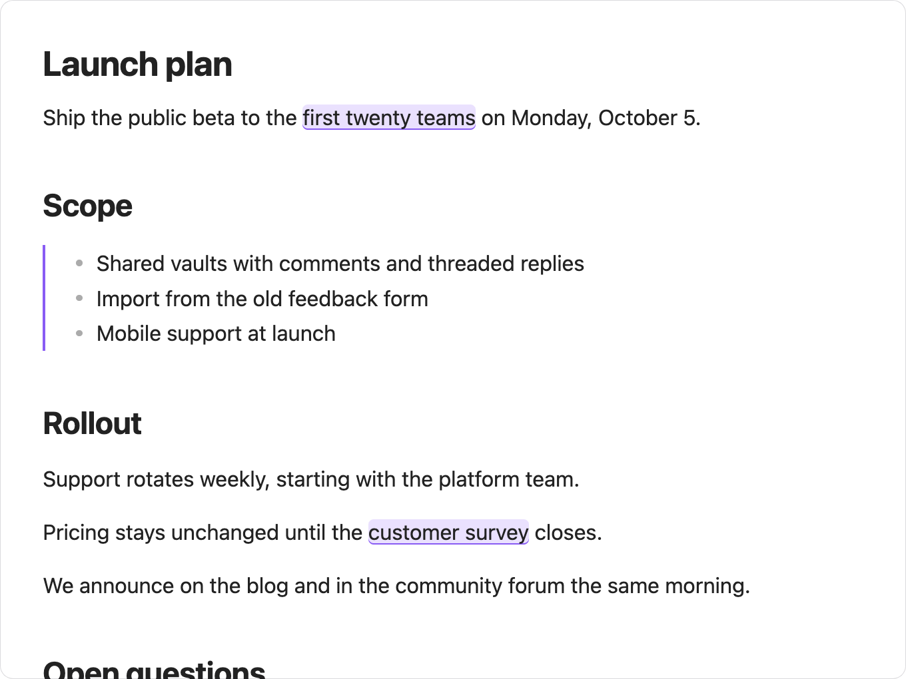
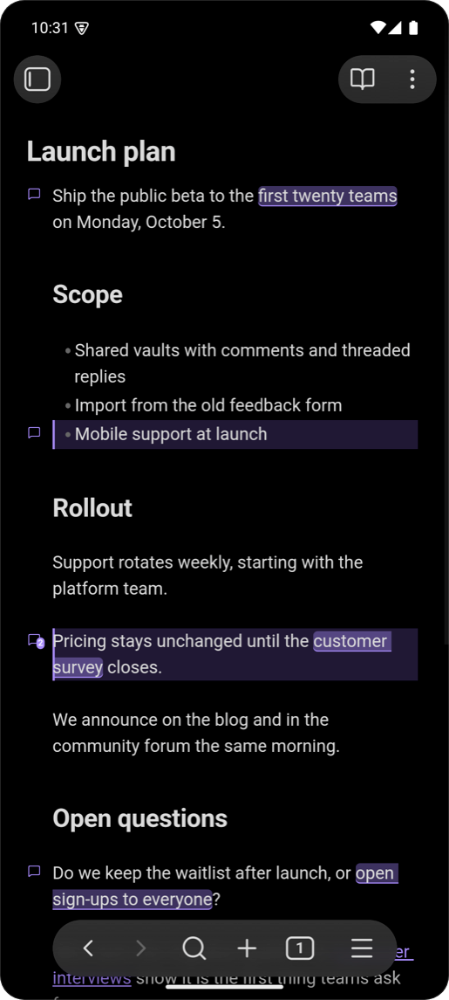
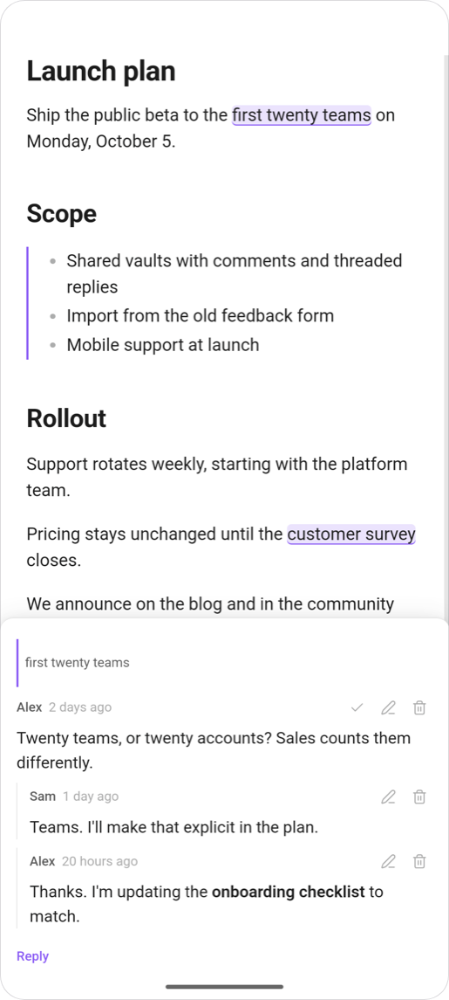
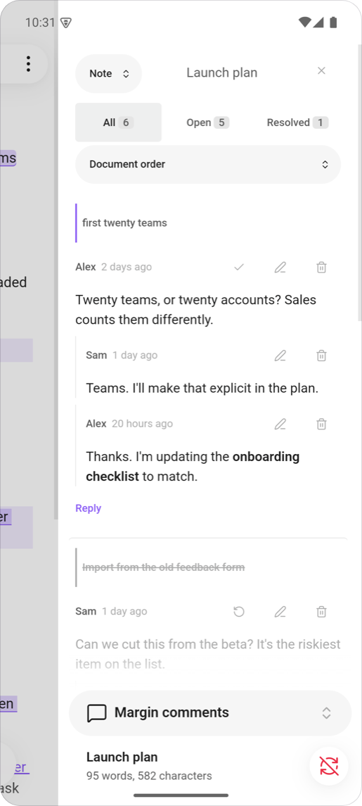
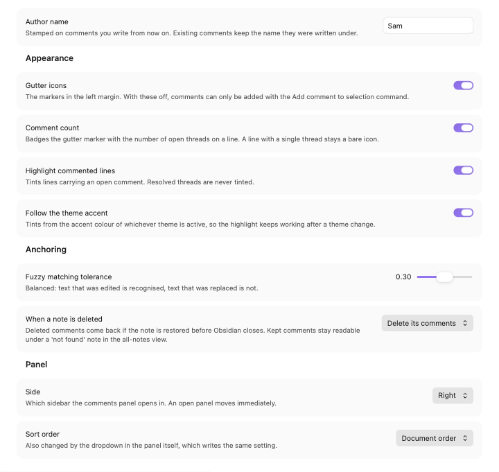

<!--
  The dark icon's URL is absolute on purpose, and must stay that way.

  The community directory renders this README on the plugin's listing page and
  rewrites relative image paths to raw.githubusercontent.com — but only in `src`,
  not in `srcset`. A relative `srcset` is left alone and then resolves against
  community.obsidian.md, where it is a 404, so the icon broke for every visitor
  in dark mode while light mode looked fine.

  HEAD rather than a branch name, so this keeps working if the default branch is
  ever renamed. GitHub renders an absolute raw URL here exactly as it renders a
  relative one.
-->

  <picture>
    <source
      media="(prefers-color-scheme: dark)"
      srcset="https://raw.githubusercontent.com/jonaas-dev/obsidian-margin-comments/HEAD/images/icon-dark.svg"
    >
    
  </picture>

<h1 align="center">Margin Comments</h1>

  Comment on your Obsidian notes the way you would on a shared document. 
  Threaded replies, resolve and reopen, and a panel for every conversation. Your Markdown stays untouched.

  
  
  
  
  
  
  
  
  
  

  

## What it does

<table>
  <tr>
    <td width="50%" valign="top">
      
      
<strong>Comment on a line or on a few words</strong> 
      Select text and comment on it, or comment on a whole line from the margin.

    </td>
    <td width="50%" valign="top">
      
      
<strong>Talk it through in threads</strong> 
      Reply, edit in place, resolve when it is settled and reopen if it is not.

    </td>
  </tr>
</table>

<table>
  <tr>
    <td width="50%" valign="top">
      
      
<strong>See every conversation in one panel</strong> 
      Filter by open or resolved, sort by position or activity, for this note or the whole vault.

    </td>
    <td width="50%" valign="top">
      
      
<strong>Read without losing the thread</strong> 
      Commented words stay highlighted in reading mode, and a click opens the conversation.

    </td>
  </tr>
</table>

### On your phone

  
  
  

Markers stay visible without hover, controls are sized for a thumb, and threads open in a sheet at the bottom of the screen. Colours come from your theme, light or dark.

## Get started

1. In Obsidian, open **Settings → Community plugins → Browse** and search for **Margin Comments**. Select **Install**, then **Enable**.
2. Open a note, hover the left margin of a line and click the marker. To comment on a few words, select them first.
3. Open the panel from the ribbon icon or the **Toggle comments panel** command to see every thread.

<strong>Install manually</strong>

1. Download `main.js`, `manifest.json` and `styles.css` from the [latest release](https://github.com/jonaas-dev/obsidian-margin-comments/releases/latest).
2. Create the folder `<your vault>/.obsidian/plugins/margin-comments/` and copy the three files into it.
3. Reload Obsidian, then enable **Margin Comments** in **Settings → Community plugins**.

<strong>Settings</strong>

Open **Settings → Margin Comments**.

| Setting | Default | What it does |
| --- | --- | --- |
| Author name | empty | The name stamped on comments you write from now on. |
| Gutter icons | on | Shows the markers in the left margin. Without them, add comments with the **Add comment to selection** command. |
| Comment count | on | Badges a marker with the number of open threads on its line, when there is more than one. |
| Highlight commented lines | on | Tints lines that carry an open comment, in editing and reading mode. |
| Follow the theme accent | on | Takes the highlight color from your theme. |
| Highlight color | none | Appears when **Follow the theme accent** is off. The color used in every theme. |
| Fuzzy matching tolerance | 0.3 | How far edited text may drift before a comment stops finding it. |
| When a note is deleted | Delete its comments | Deleted comments are held on disk and come back whenever the note does, including after a restart or a rename made outside Obsidian. Kept comments stay readable in the all-notes view. |
| Side | Right | Which sidebar the panel opens in. |
| Sort order | Document order | Document order, date created, or last activity. |

<strong>Commands</strong>

None has a default hotkey. Bind the ones you use in **Settings → Hotkeys**.

| Command | What it does |
| --- | --- |
| Add comment to selection | Comments on the selected text, or on the line holding the cursor. |
| Toggle comments panel | Opens or closes the panel. |
| Go to next comment | Moves the cursor to the next commented line. |
| Go to previous comment | Moves the cursor to the previous commented line. |
| Resolve all comments in this note | Resolves every open thread in the note, after confirming. |

<strong>How comments are stored</strong>

Comments live as JSON files in `.margin-comments/` at the root of your vault: one file per commented note, plus an index. Your Markdown files are never modified.

Each comment remembers the words it was made on and the text around them, not a line number. It follows those words as you edit, and moves with the note when you rename it or move its folder. A comment whose words are gone is kept and shown as orphaned.

A damaged comment file is set aside and reported, never overwritten.

**Syncing.** Git, iCloud and Dropbox sync the folder like any other. Obsidian Sync skips folders that start with a dot, so with Obsidian Sync your comments stay on the device where you wrote them.

**Large notes.** The panel draws every thread it shows. A note with a thousand comments takes about a quarter of a second to draw, and scrolling stays smooth.

<strong>Privacy</strong>

Each comment file is plain, unencrypted JSON. For every comment it stores the note's path, the commented words with about 50 characters on either side, the comment itself, the author name from settings, and timestamps.

Because the folder holds excerpts of your notes, treat it as part of your vault:

- **Publishing a vault** with Git, Quartz or similar tools publishes the folder too, unless you exclude it. That can include excerpts from notes you did not publish.
- **Sharing a vault** shares every comment and author name in it.
- **Deleting text** from a note does not remove it from a comment until the comment is deleted.

To keep comments out of Git, add `.margin-comments/` to `.gitignore`.

## Contributing

Bug reports and pull requests are welcome. See [CONTRIBUTING.md](CONTRIBUTING.md) for the development setup.

## License

[MIT](LICENSE)
